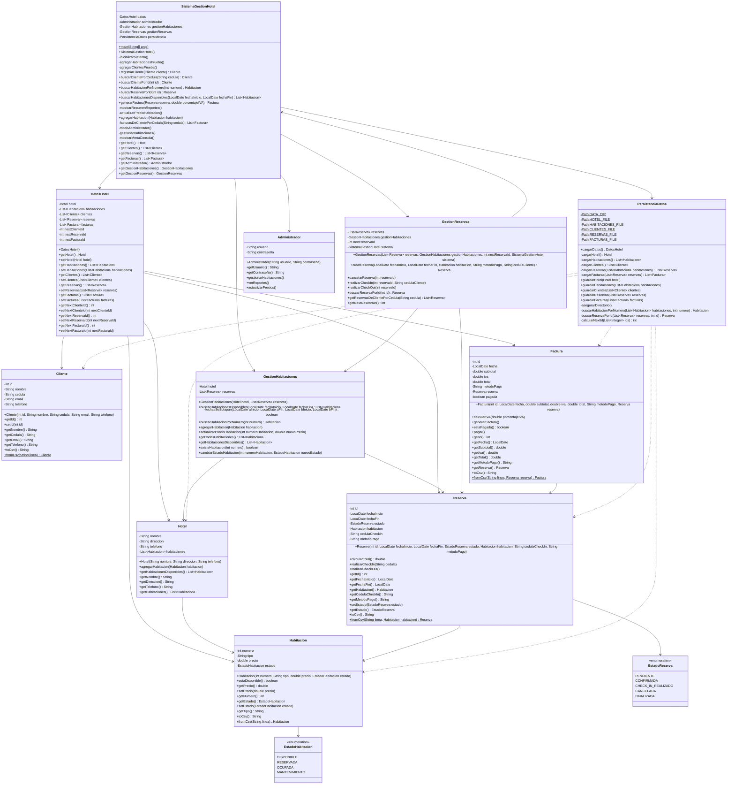

# SistemaGestionHotel

## Diagrama UML

```mermaid
classDiagram
    class SistemaGestionHotel {
        -DatosHotel datos
        -Administrador administrador
        -GestionHabitaciones gestionHabitaciones
        -GestionReservas gestionReservas
        -PersistenciaDatos persistencia
        +main(String[] args)$
        +SistemaGestionHotel()
        -inicializarSistema()
        -agregarHabitacionesPrueba()
        -agregarClientesPrueba()
        +registrarCliente(Cliente cliente) Cliente
        +buscarClientePorCedula(String cedula) Cliente
        +buscarClientePorId(int id) Cliente
        +buscarHabitacionPorNumero(int numero) Habitacion
        +buscarReservaPorId(int id) Reserva
        +buscarHabitacionesDisponibles(LocalDate fechaInicio, LocalDate fechaFin) List~Habitacion~
        +generarFactura(Reserva reserva, double porcentajeIVA) Factura
        -mostrarResumenReportes()
        -actualizarPrecioHabitacion()
        +agregarHabitacion(Habitacion habitacion)
        -facturasDeClientePorCedula(String cedula) List~Factura~
        -modoAdministrador()
        -gestionarHabitaciones()
        -mostrarMenuConsola()
        +getHotel() Hotel
        +getClientes() List~Cliente~
        +getReservas() List~Reserva~
        +getFacturas() List~Factura~
        +getAdministrador() Administrador
        +getGestionHabitaciones() GestionHabitaciones
        +getGestionReservas() GestionReservas
    }

    class DatosHotel {
        -Hotel hotel
        -List~Habitacion~ habitaciones
        -List~Cliente~ clientes
        -List~Reserva~ reservas
        -List~Factura~ facturas
        -int nextClienteId
        -int nextReservaId
        -int nextFacturaId
        +DatosHotel()
        +getHotel() Hotel
        +setHotel(Hotel hotel)
        +getHabitaciones() List~Habitacion~
        +setHabitaciones(List~Habitacion~ habitaciones)
        +getClientes() List~Cliente~
        +setClientes(List~Cliente~ clientes)
        +getReservas() List~Reserva~
        +setReservas(List~Reserva~ reservas)
        +getFacturas() List~Factura~
        +setFacturas(List~Factura~ facturas)
        +getNextClienteId() int
        +setNextClienteId(int nextClienteId)
        +getNextReservaId() int
        +setNextReservaId(int nextReservaId)
        +getNextFacturaId() int
        +setNextFacturaId(int nextFacturaId)
    }

    class Hotel {
        -String nombre
        -String direccion
        -String telefono
        -List~Habitacion~ habitaciones
        +Hotel(String nombre, String direccion, String telefono)
        +agregarHabitacion(Habitacion habitacion)
        +getHabitacionesDisponibles() List~Habitacion~
        +getNombre() String
        +getDireccion() String
        +getTelefono() String
        +getHabitaciones() List~Habitacion~
    }

    class Habitacion {
        -int numero
        -String tipo
        -double precio
        -EstadoHabitacion estado
        +Habitacion(int numero, String tipo, double precio, EstadoHabitacion estado)
        +estaDisponible() boolean
        +getPrecio() double
        +setPrecio(double precio)
        +getNumero() int
        +getEstado() EstadoHabitacion
        +setEstado(EstadoHabitacion estado)
        +getTipo() String
        +toCsv() String
        +fromCsv(String linea)$ Habitacion
    }

    class Cliente {
        -int id
        -String nombre
        -String cedula
        -String email
        -String telefono
        +Cliente(int id, String nombre, String cedula, String email, String telefono)
        +getId() int
        +setId(int id)
        +getNombre() String
        +getCedula() String
        +getEmail() String
        +getTelefono() String
        +toCsv() String
        +fromCsv(String linea)$ Cliente
    }

    class Reserva {
        -int id
        -LocalDate fechaInicio
        -LocalDate fechaFin
        -EstadoReserva estado
        -Habitacion habitacion
        -String cedulaCheckIn
        -String metodoPago
        +Reserva(int id, LocalDate fechaInicio, LocalDate fechaFin, EstadoReserva estado, Habitacion habitacion, String cedulaCheckIn, String metodoPago)
        +calcularTotal() double
        +realizarCheckIn(String cedula)
        +realizarCheckOut()
        +getId() int
        +getFechaInicio() LocalDate
        +getFechaFin() LocalDate
        +getHabitacion() Habitacion
        +getCedulaCheckIn() String
        +getMetodoPago() String
        +setEstado(EstadoReserva estado)
        +getEstado() EstadoReserva
        +toCsv() String
        +fromCsv(String linea, Habitacion habitacion)$ Reserva
    }

    class Factura {
        -int id
        -LocalDate fecha
        -double subtotal
        -double iva
        -double total
        -String metodoPago
        -Reserva reserva
        -boolean pagada
        +Factura(int id, LocalDate fecha, double subtotal, double iva, double total, String metodoPago, Reserva reserva)
        +calcularIVA(double porcentajeIVA)
        +generarFactura()
        +estaPagada() boolean
        +pagar()
        +getId() int
        +getFecha() LocalDate
        +getSubtotal() double
        +getIva() double
        +getTotal() double
        +getMetodoPago() String
        +getReserva() Reserva
        +toCsv() String
        +fromCsv(String linea, Reserva reserva)$ Factura
    }

    class GestionHabitaciones {
        -Hotel hotel
        -List~Reserva~ reservas
        +GestionHabitaciones(Hotel hotel, List~Reserva~ reservas)
        +buscarHabitacionesDisponibles(LocalDate fechaInicio, LocalDate fechaFin) List~Habitacion~
        -fechasSeSolapan(LocalDate aInicio, LocalDate aFin, LocalDate bInicio, LocalDate bFin) boolean
        +buscarHabitacionPorNumero(int numero) Habitacion
        +agregarHabitacion(Habitacion habitacion)
        +actualizarPrecioHabitacion(int numeroHabitacion, double nuevoPrecio)
        +getTodasHabitaciones() List~Habitacion~
        +getHabitacionesDisponibles() List~Habitacion~
        +existeHabitacion(int numero) boolean
        +cambiarEstadoHabitacion(int numeroHabitacion, EstadoHabitacion nuevoEstado)
    }

    class GestionReservas {
        -List~Reserva~ reservas
        -GestionHabitaciones gestionHabitaciones
        -int nextReservaId
        -SistemaGestionHotel sistema
        +GestionReservas(List~Reserva~ reservas, GestionHabitaciones gestionHabitaciones, int nextReservaId, SistemaGestionHotel sistema)
        +crearReserva(LocalDate fechaInicio, LocalDate fechaFin, Habitacion habitacion, String metodoPago, String cedulaCliente) Reserva
        +cancelarReserva(int reservaId)
        +realizarCheckIn(int reservaId, String cedulaCliente)
        +realizarCheckOut(int reservaId)
        +buscarReservaPorId(int id) Reserva
        +getReservasDeClientePorCedula(String cedula) List~Reserva~
        +getNextReservaId() int
    }

    class Administrador {
        -String usuario
        -String contraseña
        +Administrador(String usuario, String contraseña)
        +getUsuario() String
        +getContraseña() String
        +gestionarHabitaciones()
        +verReportes()
        +actualizarPrecios()
    }

    class PersistenciaDatos {
        -Path DATA_DIR$
        -Path HOTEL_FILE$
        -Path HABITACIONES_FILE$
        -Path CLIENTES_FILE$
        -Path RESERVAS_FILE$
        -Path FACTURAS_FILE$
        +cargarDatos() DatosHotel
        -cargarHotel() Hotel
        -cargarHabitaciones() List~Habitacion~
        -cargarClientes() List~Cliente~
        -cargarReservas(List~Habitacion~ habitaciones) List~Reserva~
        -cargarFacturas(List~Reserva~ reservas) List~Factura~
        +guardarHotel(Hotel hotel)
        +guardarHabitaciones(List~Habitacion~ habitaciones)
        +guardarClientes(List~Cliente~ clientes)
        +guardarReservas(List~Reserva~ reservas)
        +guardarFacturas(List~Factura~ facturas)
        -asegurarDirectorio()
        -buscarHabitacionPorNumero(List~Habitacion~ habitaciones, int numero) Habitacion
        -buscarReservaPorId(List~Reserva~ reservas, int id) Reserva
        -calcularNextId(List~Integer~ ids) int
    }

    class EstadoReserva {
        <<enumeration>>
        PENDIENTE
        CONFIRMADA
        CHECK_IN_REALIZADO
        CANCELADA
        FINALIZADA
    }

    class EstadoHabitacion {
        <<enumeration>>
        DISPONIBLE
        RESERVADA
        OCUPADA
        MANTENIMIENTO
    }

    %% Relaciones de composición/agregación
    SistemaGestionHotel --> DatosHotel
    SistemaGestionHotel --> Administrador
    SistemaGestionHotel --> GestionHabitaciones
    SistemaGestionHotel --> GestionReservas
    SistemaGestionHotel --> PersistenciaDatos
    
    DatosHotel --> Hotel
    DatosHotel --> Habitacion
    DatosHotel --> Cliente
    DatosHotel --> Reserva
    DatosHotel --> Factura
    
    Hotel --> Habitacion
    
    GestionHabitaciones --> Hotel
    GestionHabitaciones --> Reserva
    
    GestionReservas --> Reserva
    GestionReservas --> GestionHabitaciones
    GestionReservas --> SistemaGestionHotel
    
    Reserva --> Habitacion
    Reserva --> EstadoReserva
    Factura --> Reserva
    
    Habitacion --> EstadoHabitacion
    
    PersistenciaDatos ..> Hotel
    PersistenciaDatos ..> Habitacion
    PersistenciaDatos ..> Cliente
    PersistenciaDatos ..> Reserva
    PersistenciaDatos ..> Factura
```
