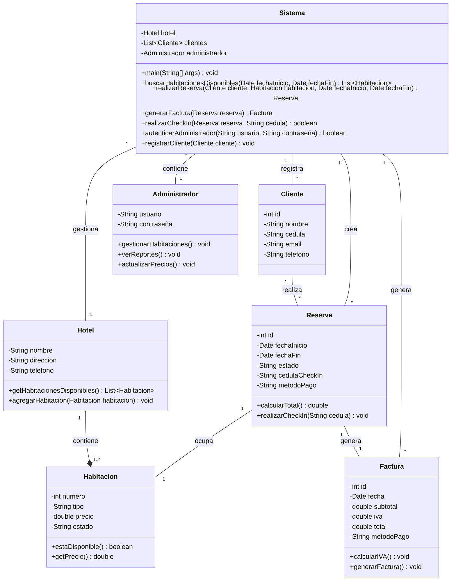

# SistemaGestionHotel

## Diagrama UML

```mermaid
classDiagram
    class Sistema {
        -Hotel hotel
        -List~Cliente~ clientes
        -Administrador administrador
        +main(String[] args) void
        +buscarHabitacionesDisponibles(Date fechaInicio, Date fechaFin) List~Habitacion~
        +realizarReserva(Cliente cliente, Habitacion habitacion, Date fechaInicio, Date fechaFin) Reserva
        +generarFactura(Reserva reserva) Factura
        +realizarCheckIn(Reserva reserva, String cedula) boolean
        +autenticarAdministrador(String usuario, String contraseña) boolean
        +registrarCliente(Cliente cliente) void
    }

    class Hotel {
        -String nombre
        -String direccion
        -String telefono
        +getHabitacionesDisponibles() List~Habitacion~
        +agregarHabitacion(Habitacion habitacion) void
    }

    class Habitacion {
        -int numero
        -String tipo
        -double precio
        -String estado
        +estaDisponible() boolean
        +getPrecio() double
    }

    class Cliente {
        -int id
        -String nombre
        -String cedula
        -String email
        -String telefono
    }

    class Reserva {
        -int id
        -Date fechaInicio
        -Date fechaFin
        -String estado
        -String cedulaCheckIn
        -String metodoPago
        +calcularTotal() double
        +realizarCheckIn(String cedula) void
    }

    class Factura {
        -int id
        -Date fecha
        -double subtotal
        -double iva
        -double total
        -String metodoPago
        +calcularIVA() void
        +generarFactura() void
    }

    class Administrador {
        -String usuario
        -String contraseña
        +gestionarHabitaciones() void
        +verReportes() void
        +actualizarPrecios() void
    }

    Sistema "1" -- "1" Hotel : gestiona
    Sistema "1" -- "1" Administrador : contiene
    Sistema "1" -- "*" Cliente : registra
    Sistema "1" -- "*" Reserva : crea
    Sistema "1" -- "*" Factura : genera
    Hotel "1" --* "1..*" Habitacion : contiene
    Cliente "1" -- "*" Reserva : realiza
    Reserva "1" -- "1" Habitacion : ocupa
    Reserva "1" -- "1" Factura : genera
```
